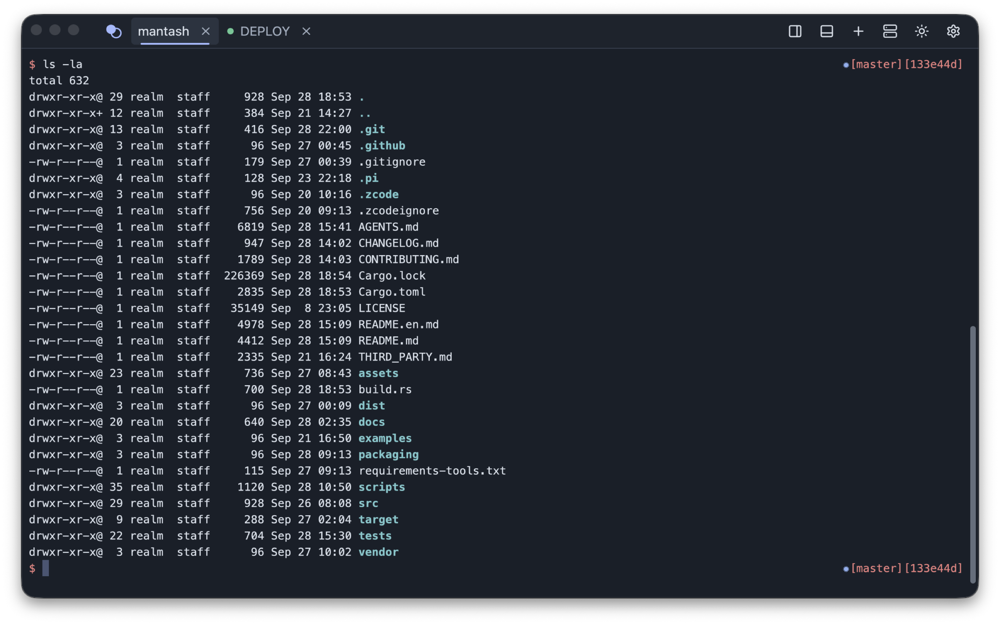
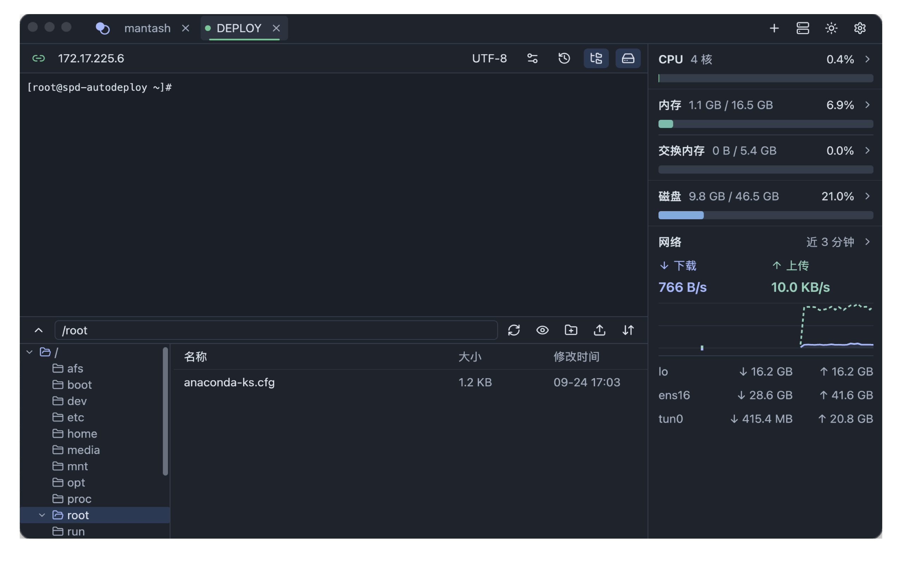
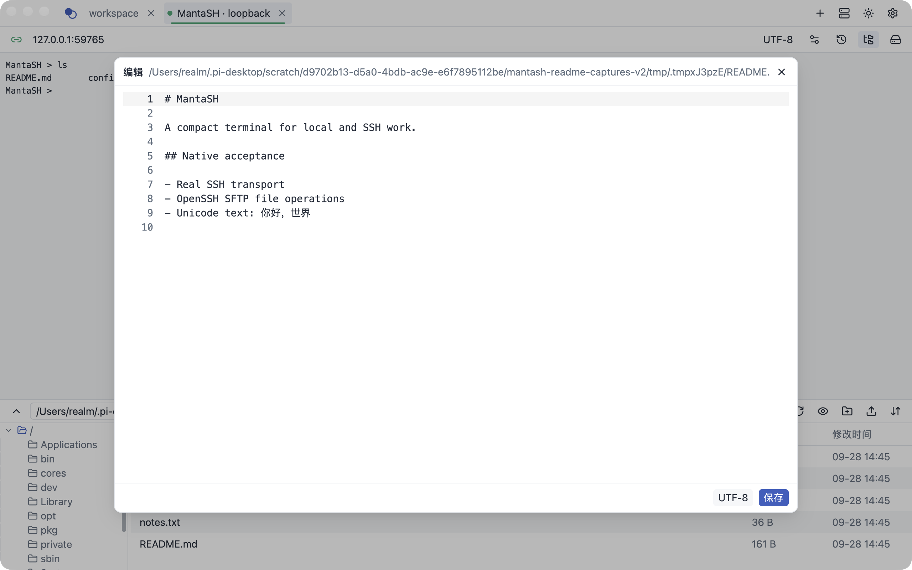
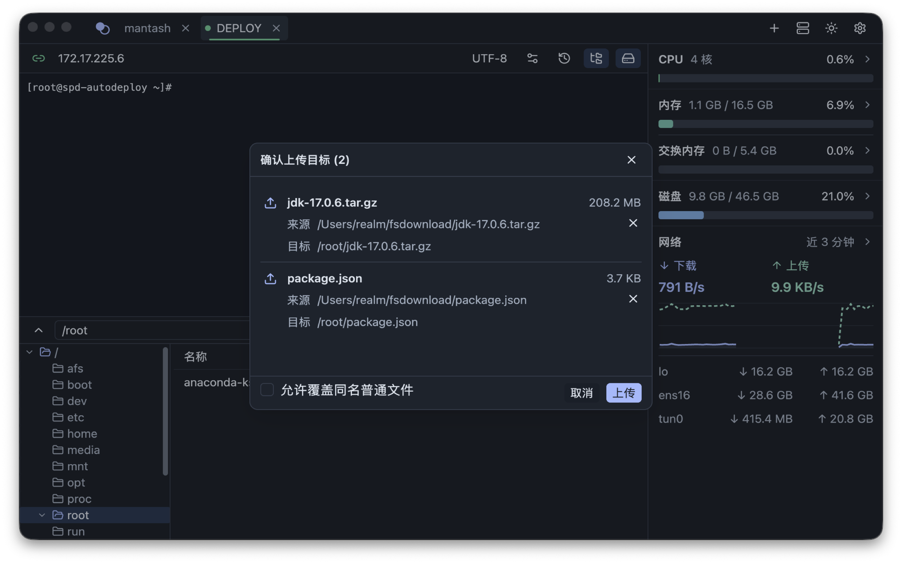
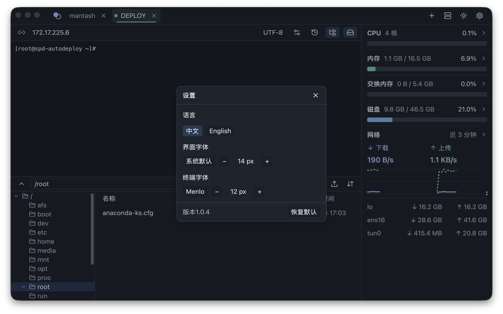

# MantaSH

[中文](README.md)

**MantaSH** is a native terminal workspace built with Rust and GPUI. It brings local Shells, SSH, remote files, editing and Linux host monitoring into one window.

[](https://github.com/realmx/mantash/actions/workflows/ci.yml) [](LICENSE)

## Install

Install on macOS with Homebrew. Repeating the command when the latest version is installed only reports that no upgrade is needed; update with `brew upgrade --cask mantash`.

```sh
brew install realmx/taps/mantash --cask
```

Alternatively, download the package for your architecture from [GitHub Releases](https://github.com/realmx/MantaSH/releases). On macOS, open the DMG and drag the app into Applications; on Windows, run the installer.

| Platform | Architecture | Release package |
|---|---|---|
| macOS | Apple Silicon | `MantaSH-X.Y.Z-macos-arm64.dmg` |
| macOS | Intel | `MantaSH-X.Y.Z-macos-x64.dmg` |
| Windows | x86 | `MantaSH-X.Y.Z-windows-x86-setup.exe` |
| Windows | x64 | `MantaSH-X.Y.Z-windows-x64-setup.exe` |
| Windows | ARM64 | `MantaSH-X.Y.Z-windows-arm64-setup.exe` |

`X.Y.Z` is the release tag version; every package has a `.sha256`. macOS packages are ad-hoc signed and not notarized. Gatekeeper may block first launch: verify the source and use the system's Open Anyway steps in the [user guide](docs/user-guide.md), without disabling security checks. Windows installers are unsigned and may prompt SmartScreen; Windows installation and runtime have not been verified on hardware. No portable ZIP is provided.

## Capabilities

- Local PTY terminals, tabs and Shell history; each local tab supports up to five mixed split panes. SSH tabs cannot be split.
- SSH password authentication and host-fingerprint verification. Passwords are sent only after host approval and encrypted locally with AES-256-GCM after successful authentication, without a master password or system Keychain.
- SFTP browsing and transfers, remote text editing (regular text up to 8 MB; last-write-wins saves), and shared history across SSH tabs.
- Resource, process and port monitoring for Linux hosts; Chinese and English, themes, fonts and workspace restoration.

Key-based SSH authentication, servers offering only RSA host keys and directory upload through the picker are not supported. See [features and scope](docs/features.md) for other boundaries.

## Get Started

The first launch opens a local Shell; use the plus button for another local tab. Open Connections to add an SSH profile, and verify its host fingerprint through a trusted channel before connecting.

Profiles support five-column CSV import/export: `name,host,port,username,password`. Exported passwords are plaintext, so treat the CSV as sensitive. On restart, local tabs start new Shells, SSH requires manual reconnection, and editor drafts are not retained. See the [user guide](docs/user-guide.md).

## Screenshots

These are full native macOS debug-window captures from an isolated data directory. SSH/SFTP uses a real loopback test server; ports and temporary paths belong to that fixture, with no real credentials.











## Development and Releases

Building from source requires Rust 1.88 and the native C/C++ toolchain for your platform; the first build downloads dependencies. See [development](docs/development.md) for platform setup.

```sh
git clone https://github.com/realmx/MantaSH.git
cd MantaSH
cargo run --locked
```

Basic checks:

```sh
cargo fmt --all -- --check
cargo test --locked --no-default-features --all-targets
cargo check --locked --no-default-features --all-targets
python3 scripts/check_docs.py
```

`Cargo.toml` is the source version baseline; maintainers choose major/minor changes manually. Updates to `master` containing only root Markdown files, Markdown files in `docs/`, or screenshots in `assets/screenshots/` create no tag or Release. Other changes are compared against the last version tag and create one `vX.Y.Z` tag without a version commit. Release builds temporarily sync version metadata; published versions are defined by tags and Releases, while branch builds only provide short-lived artifacts. See the [release guide](docs/release.md).

## Documentation and License

The [documentation index](docs/README.md) links the user guide, development, architecture, data, platform and acceptance records. See also the [contribution guide](CONTRIBUTING.md). MantaSH is licensed under [GPL-3.0-or-later](LICENSE); third-party licenses are listed in the [third-party notices](THIRD_PARTY.md).
