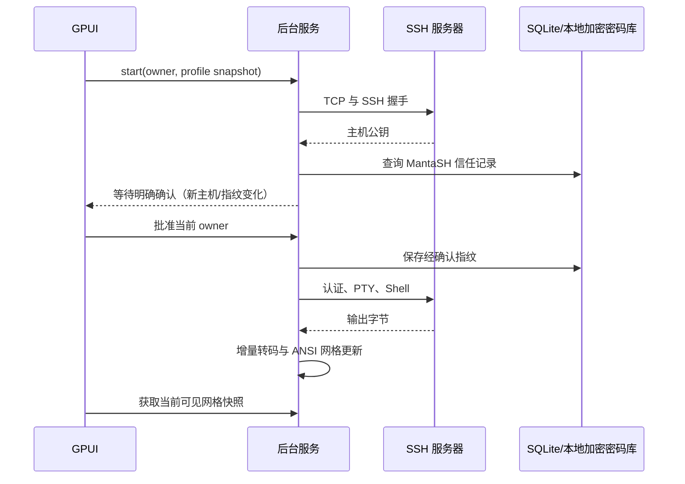

# 架构与数据流

MantaSH 是独立 Rust 工程。桌面视图采用 GPUI；服务模块在不启用 desktop feature 时也能测试。

界面向服务发送带会话标识和尝试标识的请求，后台任务通过类型化事件返回结果。运行会话保留连接配置快照；编辑文档和传输任务固定所属连接，不依赖当前选中的标签。UI 不直接访问数据库或执行网络 IO。

终端采用 alacritty_terminal 解析 ANSI，portable-pty 负责本地伪终端，russh/russh-sftp 负责 SSH 和文件协议。SQLite 持久化元数据，本地加密密码库在 SSH 密码认证成功后自动保存凭据。

源码在 src 下按 model、storage、encoding、connections、terminal、ssh、files、monitor、processes、layout、titles、platform 和 ui 分层；模块职责与测试入口见[开发验证](development.md)。`file_selection` 保存当前文件视图的路径选区、连续选择起点和键盘终点：不写入配置或跨重启恢复，目录成功更换或刷新后清空，隐藏文件过滤时移除不可见目标；批量操作在弹层创建时固定原会话与目标路径。

macOS 调试使用 GPUI runtime_shaders，绕过对独立 metal 编译器的构建期依赖，运行时仍使用 Metal。Windows 调试走 GPUI Windows 后端，必须在 Windows 机器实际运行验收。

## 连接生命周期

Owner 由 session UUID 和 attempt UUID 构成。重连保留 session 并更换 attempt，关闭时只匹配当前 attempt。主机确认使用一次性回复通道；关闭、取消或握手超时后旧回复不能授权新的连接。

`credentials::SecretStore` 隔离阻塞的本地凭据操作，正式使用 `vault::LocalVault`，协议测试注入独立内存实现。服务必须完成主机验证后才读取凭据或认证。缺失、读取失败或认证拒绝会产生带 Owner 的 `Credentials` 事件和一次性回复通道，进入 `CredentialsRequired`；后台请求排队，用户切入对应窗格后才展示，不抢焦点。

`CredentialReply` 不实现 Debug/序列化，秘密使用 Zeroizing；取消和重连使旧回复失效。提交后只针对该连接尝试认证，拒绝后等待用户更正，不自动循环重试。认证成功后才在后台写入本地加密密码库，`CredentialStorage` 单独反馈写入结果，失败不撤销认证；使用已保存值连接成功不重复写入。连接库和重连按钮均直接进入该流程，UI 不执行同步密钥派生或数据库读取。

SSH Handle 可开多个独立通道。终端、SFTP 和监控不共用标准输出流。SFTP 懒加载并可重试，失败不销毁仍在运行的终端。

## 终端与历史

TerminalBuffer 由短时间互斥锁保护。读取线程增量解码并交给 alacritty_terminal，GUI 在网格版本变化时尝试获取可见快照，释放锁后生成稀疏绘制数据；绘制阶段不会等待 PTY 解析锁。默认空白不单独绘制，相邻同色背景和安全 ASCII 文字合并，中文/组合字符保持独立单元格坐标，未变化行复用 ShapedLine。选区、搜索和滚动也递增版本，避免缓存过期。字体测量结果按字体/字号缓存；字体变化测量 M 的宽度及实际字形高度，重新计算网格，并通过命令通道通知 PTY/SSH。唤醒与刷新调度详见[终端机制参考](terminal-reference.md)。

历史来自 Shell 通过本次连接独立 nonce 的 OSC 报告。nonce 用于隔离会话和排除误识别，不构成对恶意远端进程的可信认证。每条记录保留来源连接 UUID，但所有 SSH 来源聚合到同一历史列表；本地历史独立。命令只在用户明确选择执行后才发送。Shell 自己读取其正常配置和历史的行为与 MantaSH 直接扫描历史文件不同。

Bash 在已有自定义 DEBUG trap 时不覆盖它；不能可靠确定是新历史记录时不收录。PowerShell 保留原 AddToHistoryHandler 返回值，不持久化 MemoryOnly/SkipAdding 报告，并对敏感词保守过滤。API 语义参考 [Microsoft 文档](https://learn.microsoft.com/en-us/powershell/module/psreadline/set-psreadlineoption#-addtohistoryhandler)。

## 文件与传输

目录导航有独立 request ID，旧导航结果不会覆盖新路径。Document 保留打开时的 owner，重连不改变草稿归属；保存携带 revision，仅当前版本保存成功才清除 dirty。

文件保存先严格编码并读取当前目标，复核它仍为可读普通文件；不因内容较打开时更新而拒绝保存。随后写入同目录临时文件，用唯一恢复文件保护原内容后按最后保存覆盖；失败保留草稿与恢复路径。传输固定连接、路径和原始尝试，最多两个并发任务，取消保持终态；结果独立持久化。确认按显示的目标快照提交，重试创建新任务 UUID；隔离 QA 只在显式目录及回环目标内替代路径选择器。

## 光标定位

`command_cursor` 解析带当前会话 nonce 的 ready/running 标记。`TerminalBuffer.feed` 在标记对应的字节边界捕获提示符末尾，并根据回显网格维护可编辑范围；用户提交输入时先失效定位状态。单击计划只生成左右方向键，经过原 Session 输入通道交给 Shell，等待真实回显后更新画面。宽字符的占位格不计作独立字符，自动换行根据终端 WRAPLINE 处理。

没有可靠提示符、已经回滚查看历史、运行中的应用和密码输入不采用这条路径。应用主动开启鼠标报告时使用 SGR/UTF-8/传统 xterm 鼠标协议；拖动和 Shift 选择分别处理。内置编辑器通过原始文档 Owner + ID 验证行列，调用原生 InputState 定位，不修改内容。

## 布局、工具与标题

布局树与终端实体分开：布局调整只改变几何，不重新创建 PTY、SSH 或编辑器。Workbench 持有稳定 Pane UUID，运行 Owner 的 attempt 在重连时更换；每个标签保存最后活动的窗格。只有本地标签可以调用分屏，UI 和业务方法都限制为 5 个。

标题栏中间有独立 ScrollHandle，标签内容不能参与祖先最小宽度计算。新建、切换、字体/窗口变化后定位活动标签，用户主动滚动时后台输出不拉回视角。顶栏只展示应用图标，选中标签使用统一底色和细底线，文字按钮不叠加悬浮背景。

每个 SSH Pane 保存文件浏览、草稿、系统概览及各自筛选/滚动状态。右侧工具面板只显示系统概览；在线编辑在独立模态弹窗中打开。右栏实际宽度由窗口客户区宽度和用户偏好计算，最大 50%，临时限宽不回写。文件工具首次可见后懒加载；空目录不会造成周期性重复请求。

终端标题和目录事件更新原 Owner；可靠 Shell 报告提供保守的程序开始/结束元数据，本地标签使用聚焦窗格的目录/程序，SSH 标签使用参数快照的连接名称或地址。标题不会改写连接资料。

## 监控与进程操作

`monitor::SAMPLE_COMMAND` 使用固定 Linux 命令，读取系统、CPU、内存、网络、df、ps、ss。采样前后读取进程启动标识，只为一致实例补充 Identity。CPU/网络依据同次开机的两次单调采样计算差值；首次或不可用数据留空并说明。Linux 的进程状态字段与权限语义参考[内核 /proc 文档](https://www.kernel.org/doc/html/latest/filesystems/proc.html)。

`processes` 将目标限定为 PID + 启动 ticks + boot UUID，普通/强制信号以枚举表示。后台操作先确认 Owner 的 transport 仍然有效，再在服务器复核身份与内核线程标记。详情命令按上限读取并编码文本，避免任意显示内容进入脚本。每个详情/信号结果携带 owner 和 request，过期结果不更新当前弹层或新的连接。

系统概览在 SSH 连接成功后自动采样，面板可见期间每 3 秒刷新；断开后清空监控数据。进程和端口通过概览卡片打开弹窗，弹窗随概览采样更新。用户明确提交的信号操作有最长 10 秒的结果复核；列表只在有效新采样时替换，不把发送成功当作进程已退出。

## 持久化与关闭

后台任务通过互斥锁串行访问 SQLite；偏好和连接整批写入附带递增版本检查。退出前等待最终布局写入，再关闭会话与任务。无法读取原数据库时创建本次运行内存数据库，保留原文件并明确提示。

详见[数据接口](data.md)、[开发验证](development.md)和[平台验收](acceptance.md)。
